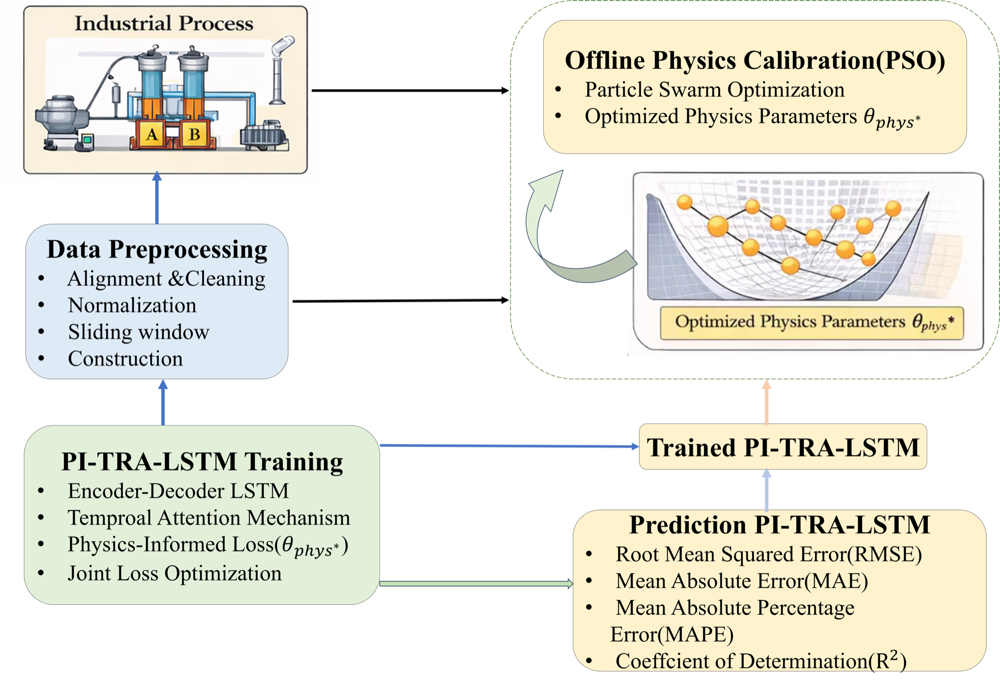
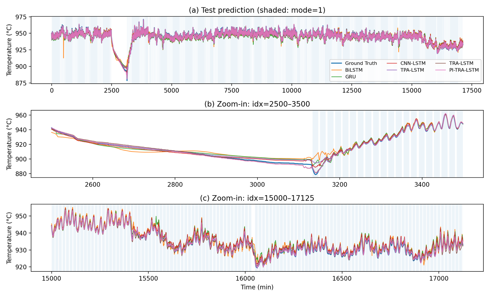
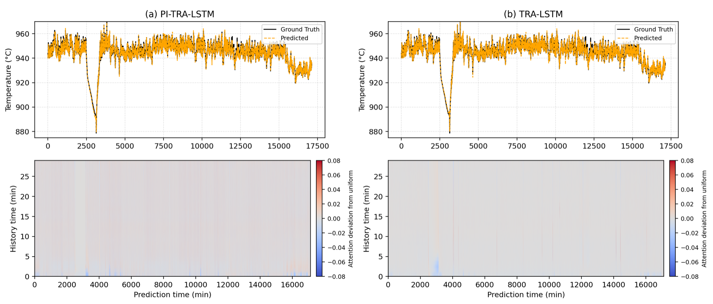
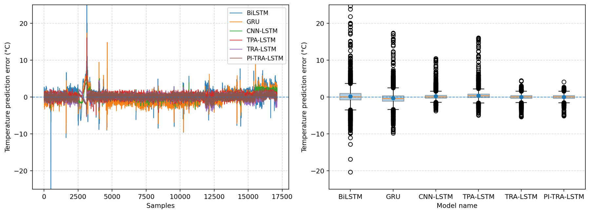

<div align="center">

# Kiln-R1: Physics-Informed Temporal Re-Attention LSTM for Twin-Shaft Lime Kilns

**Learning a Physics-Informed Temporal Re-Attention LSTM Network for Temperature Process Modeling in Twin-Shaft Lime Kilns**


[Installation](#installation) | [Training](#training) | [Evaluation](#evaluation) | [Repository Structure](#repository-structure) | [Citation](#citation)

</div>

---

## Overview

Twin-shaft lime kilns are typical industrial thermal systems with strong heat inertia, alternating shaft combustion, delayed material transformation, and complex process coupling. Accurate temperature-process modeling is difficult because kiln dynamics are not determined by a single instantaneous variable, but by the joint effects of fuel input, combustion air, cooling air, material residence, switching operation, and historical quality state.

This repository provides a standardized implementation of **PI-TRA-LSTM**, a physics-informed temporal re-attention LSTM framework for twin-shaft lime kiln process modeling.

The framework addresses three key challenges:

- **Long-term thermal inertia:** lime kiln temperature evolution is strongly delayed and history-dependent.
- **Operating-mode switching:** the two shafts alternate between combustion and heat-storage states, introducing nonstationary dynamics.
- **Physical consistency:** pure data-driven models may fit observed signals but violate thermal-process constraints under abnormal or switching conditions.

PI-TRA-LSTM combines temporal attention, recurrent sequence modeling, and physical residual constraints to improve prediction accuracy and interpretability.

## Method

PI-TRA-LSTM follows a physics-informed sequence modeling design:

1. **Temporal Encoding:** historical operating sequences are encoded by an LSTM backbone.
2. **Temporal Attention:** the model learns which historical time steps contribute most to the current prediction.
3. **Physics-Informed Loss:** an equivalent thermal-process residual constrains temperature evolution.
4. **Risk-Aware Penalty:** high under-burning risk states receive additional training emphasis.
5. **PSO Calibration:** equivalent physical parameters can be calibrated before model training.

<p align="center">
  
</p>

## Key Results

The benchmark compares PI-TRA-LSTM with traditional machine-learning models and deep sequence models, including EN, MLP, SVM, LSTM, BiLSTM, GRU, CNN-LSTM, TPA-LSTM, and TRA-LSTM.

### Prediction Comparison

<p align="center">
  
</p>

### Attention Interpretation

The attention map illustrates how PI-TRA-LSTM focuses on different historical windows during normal, abnormal, and tail-drift periods.

<p align="center">
  
</p>

### Error Distribution

<p align="center">
  
</p>

## Installation

Clone the repository:

```bash
git clone https://github.com/qiaojimei/Twin-Shaft-Lime-Kiln-PI-TRA-LSTM.git
cd Twin-Shaft-Lime-Kiln-PI-TRA-LSTM
```

Create a conda environment:

```bash
conda create -n kiln-r1 python=3.10 -y
conda activate kiln-r1
```

Install dependencies:

```bash
pip install -r requirements.txt
```

If `requirements.txt` is unavailable, install the core dependencies manually:

```bash
pip install numpy pandas scikit-learn matplotlib torch
```

For GPU training, install the PyTorch build matching your CUDA version from the official PyTorch website.

## Data Preparation

Place the raw DCS CSV file under a local data folder:

```text
Kiln-R1/
`-- data_src/
    `-- limekiln.csv
```

Then edit [config.py](config.py):

```python
CONFIG["original_csv"] = "data_src/limekiln.csv"
CONFIG["device"] = "cuda"  # or "cpu"
```

The default data split is time ordered:

```text
train : validation : test = 70% : 10% : 20%
```

This avoids future information leakage.

## Training

Run the full benchmark:

```bash
python -m PI_TRA_LSTM_modular.run
```

The default training protocol is:

```text
optimizer       Adam
learning rate   5e-4
batch size      128
max epochs      500
scheduler       StepLR(step_size=200, gamma=0.5)
early stopping  validation-loss based
```

To run in PyCharm:

1. Open this repository folder.
2. Select the Python interpreter or conda environment.
3. Edit `CONFIG["original_csv"]` in [config.py](config.py).
4. Run [main.py](main.py) or [run.py](run.py).

## Evaluation

The benchmark reports:

- R2
- MSE
- MAE
- MAPE
- RMSE
- training time
- trainable parameter count

Main outputs are saved to the configured result directory:

```text
results/
|-- benchmark_report.csv
|-- pred_*.csv
|-- predmeta_*.csv
|-- curve_*.csv
|-- lc_*.png
|-- err_*.png
|-- pred_*.png
`-- segment_metrics_*.csv
```

Model checkpoints are saved as:

```text
checkpoints/
`-- *_best.pt
```

## Repository Structure

```text
Kiln-R1/
|-- README.md
|-- DEPLOYMENT.md
|-- requirements.txt
|-- config.py
|-- common.py
|-- data_process.py
|-- model_blocks.py
|-- models/
|   |-- __init__.py
|   `-- model_zoo.py
|-- physics.py
|-- train_torch.py
|-- plot_utils.py
|-- sensitivity.py
|-- segment_eval.py
|-- main.py
|-- run.py
`-- assets/
    |-- process.png
    |-- prediction_comparison.png
    |-- attention_comparison.png
    `-- error_comparison.png
```

## Notes

- Private industrial datasets are not included in this repository.
- The previous `PI-QTRA-LSTM` naming has been removed from this standardized version.
- The main physics-informed attention model is consistently named **PI-TRA-LSTM**.
- For GitHub release, do not commit raw data, large result folders, or checkpoint files.

## Citation

If this repository is useful for your research, please cite:

```bibtex
@article{kilnr1_pitralstm,
  title = {Learning a Physics-Informed Temporal Re-Attention LSTM Network for Temperature Process Modeling in Twin-Shaft Lime Kilns},
  author = {Anonymous},
  journal = {Under Review},
  year = {2026}
}
```

## Acknowledgement

This codebase is developed for physics-informed industrial time-series modeling in twin-shaft lime kilns.
